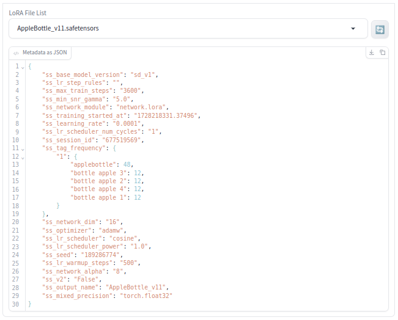

# sd-webui-lora_metadata_viewer
#### :arrow_right: Extension for the AUTOMATIC1111 Web UI

<p align="justify"><b>sd-webui-lora_metadata_viewer</b> is an <i>Extension</i> for the <a href="https://github.com/AUTOMATIC1111/stable-diffusion-webui">AUTOMATIC1111</a> web UI. Metadata from a LoRA file can be shown in a textbox.</p>

---

## Presumptions

<p align="justify">At the moment I am using the <i>AUTOMATIC1111</i> web UI [1] together with the <i>Extension</i> <i>TrainTrain</i> [3] for the LoRA modelling. The <i>Extension</i> currently under development should be compatible with the current <i>AUTOMATIC1111</i> version. It should work with the LoRA models developed with <i>AUTOMATIC1111</i> and <i>TrainTrain</i> as well as with LoRA models from other sources. The file type of the LoRA model must be in <code>.safetensors</code> format.</p>

## Preface

<p align="justify">The existing tools don't have the functionality I need for my work. So I wrote myself a suitable extension.</p>

## Goal

<p align="justify">Simple to use tool, which simply shows the metadata in JSON format.</p>

## Technical Background

<p align="justify">A <code>.safetensors</code> files consist of a <i>header</i> and a <i>binary part</i> with the tensors. In the <i>header</i> there may be most of the time <i>metadata</i>. One tag of these <i>metadata</i> specifies the output name. If the filename is not changed the output name is equal to the filename.</p>

## What the Extension Does

<p align="justify">One can select a LoRA file from a dropdown menu. Sorting is possible in alphabetical forward and backward direction. The selected filename without extension is shown in a textbox. In parallel the JSON data is shown in textbox underneath.</p>

<a target="_blank" href=""></a>

<i>Figure 1: Opened panel of extension</i>

<p align="justify"></p>

## Installation

<p align="justify">Go to the tab <code>Extensions</code>. Then go to the tab <code>Install from URL</code>.</p> 
    
<p align="justify">The installation link is</p>

```
https://github.com/zentrocdot/sd-webui-lora_metadata_viewer
```

## Know Problem

<p align="justify">No problems known yet.</p>

## Development and Test Environment

<p align="justify">The Extension was devolped and tested on a machine with a Debian based Linux distribution istalled using the web UI AUTOMATIC111 with following specification:</p>

+ API: v1.10.0
+ Python: 3.10.14
+ torch: 2.1.2+cu121
+ xformers: 0.0.23.post1
+ gradio: 3.41.2

## Critical Points AUTOMATIC1111

<p align="justify"><i>AUTOMATIC1111</i> uses <i>Gradio</i> to programme the web user interface. <i>The Gradio</i> version used is extremely buggy and outdated. Currently my local installed version is 5.0.1, <i>AUTOMATIC1111</i> is using version 3.41.2. Following some forum posts the outdated <i>Gradio</i> version is given priority over an adaptation or update. This does not really motivates to programme extensions.</p>

<p align="justify">Even in the Python Virtual Environment, which <i>AUTOMATIC1111</i> is using, the subsequent installation of Python modules is not unproblematic. There is often a mismatch in versions and dependencies. It must be clarified on a case-by-case basis how problematic the corresponding warning or error messages are. So far I have been able to solve every problem that has arisen.</p>

<p align="justify">I am still looking for a good documentation on how to integrate custom <i>Extensions</i> into <i>AUTOMATIC1111</i>. So far I have to resort to analysing other extensions and also having a look at the code of <i>AUTOMATIC1111</i>. This is a very unsatisfactory approach.</p>

# TO-Do

Improvement of documentation.

# Reference

[1] https://github.com/AUTOMATIC1111/stable-diffusion-webui

[2] https://github.com/AUTOMATIC1111/stable-diffusion-webui/wiki/Extensions

[3] https://github.com/hako-mikan/sd-webui-traintrain

<hr width="100%" size="2">

<p align="justify">There are various ways to support my work. One option is to purchase some of my extraordinary NFTs :smiley:. Some of my great collections can be found here:</p>

* https://opensea.io/collection/fantastic-mushroom-collection
* https://opensea.io/collection/cats-with-hats-collection-1
* https://opensea.io/collection/devil-woman-collection
* https://opensea.io/collection/cup-of-ice-no-1

<hr width="100%" size="2">

<p align="center">I loved the time when you could get also a hamburger :hamburger: for one Euro!</p>

<p align="center">
<a target="_blank" href="https://www.buymeacoffee.com/zentrocdot"></a>
</p>
<hr width="100%" size="2">

<p align="justify">If you like what I present here, or if it helps you, or if it is useful, you are welcome to donate a small contribution or a cup of coffee. Or as you might say: Every TRON counts! Many thanks in advance! :smiley:</p>

<pre>TQamF8Q3z63sVFWiXgn2pzpWyhkQJhRtW7            (TRON)
DMh7EXf7XbibFFsqaAetdQQ77Zb5TVCXiX            (DOGE)
12JsKesep3yuDpmrcXCxXu7EQJkRaAvsc5            (BITCOIN)
0x31042e2F3AE241093e0387b41C6910B11d94f7ec    (Ethereum)</pre>
